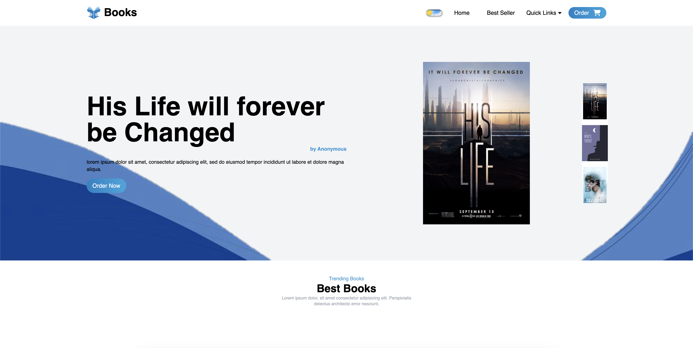
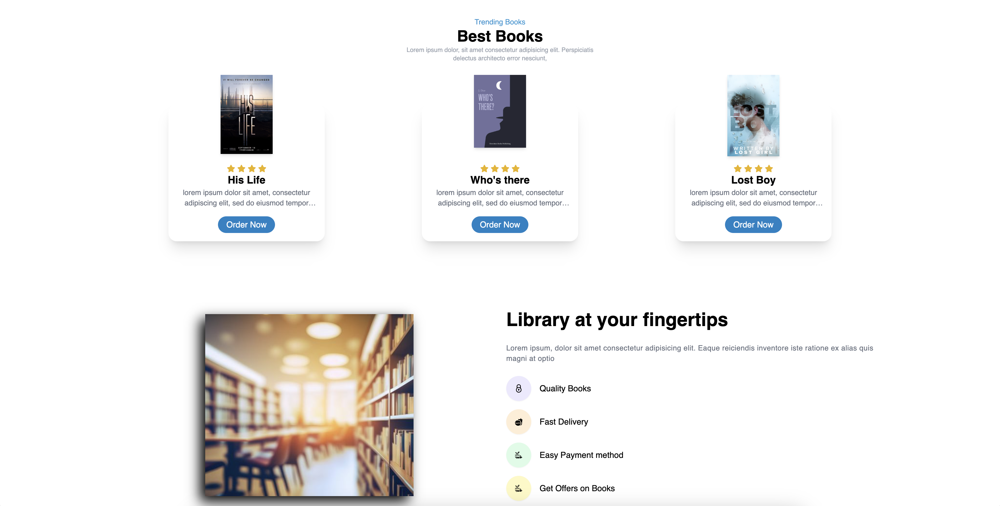
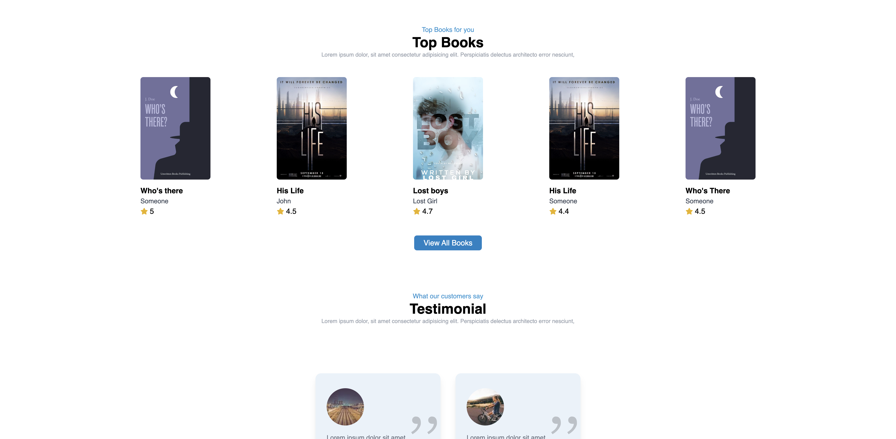

# Bookshop

Welcome to the Bookshop repository! This project is a simple yet powerful bookshop application built with React and Redux, providing a delightful experience for book enthusiasts.

## Features

- **Book Catalog:** Explore a vast collection of books with detailed information.
- **User Authentication:** Register and log in to manage your book wishlist and reviews.
- **Search and Filter:** Easily find books based on genres, authors, and more.
- **Responsive Design:** Enjoy a seamless experience on various devices.

## Screenshots

### Homepage


### Book Details


### User Dashboard


## Technologies Used

- Frontend: React.js
- State Management: Redux
- User Authentication: Firebase Authentication
- ...

## Getting Started

1. **Clone the Repository:**
   ```bash
   git clone https://github.com/your-username/bookshop.git
